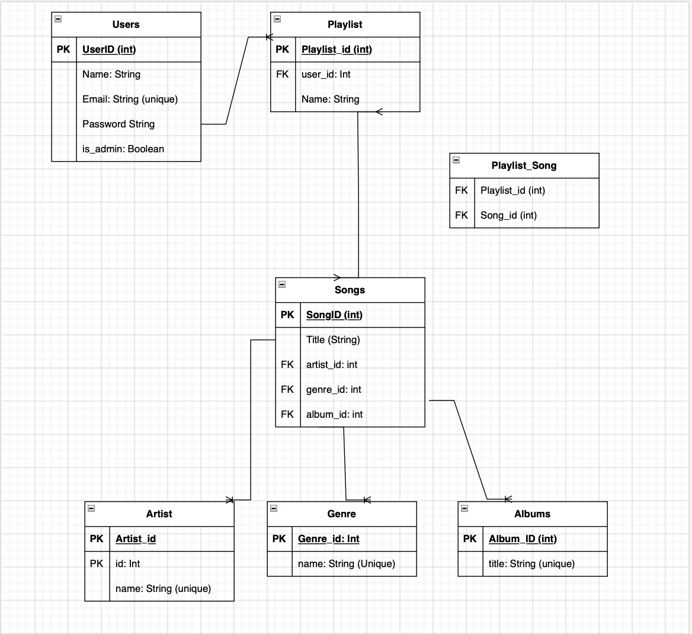

# MaestroApp

## R1
Problem Addressed by the Application: In today’s digital music landscape, users often find themselves overwhelmed by vast libraries of songs, artists, albums, and genres. The challenge is to not only store this data but also to navigate it effectively. Users want a way to:

Organize Their Music: As music collections grow, it becomes increasingly difficult to keep track of what’s available, leading to frustration when trying to find specific songs or albums.

Create Personalized Experiences: Users enjoy curating their playlists to reflect their mood or occasions. However, without an efficient method to manage playlists, this task can become cumbersome.

Manage Relationships: Users may want to see how songs relate to artists, albums, and genres, enriching their understanding of their music preferences.

Security and Accessibility: Users also need assurance that their personal data (like account information and playlists) is secure, along with easy access from various devices.

How the Application Solves This Problem:

Structured Database Design: The application utilizes a relational database, which organizes music data into tables (Artists, Albums, Songs, Genres, Playlists). Each table represents a distinct entity, and relationships among these tables enable users to easily navigate between different types of music data.

Intuitive API Endpoints: The app exposes various API endpoints that allow users to interact with their music collections programmatically. This enables integration with front-end applications, mobile apps, or even third-party services, giving users flexibility in how they access their music.

Playlist Management: Users can create, update, and delete playlists with ease. Each playlist can include multiple songs, and users can manage these songs through simple API calls. This encourages engagement with their music library.

Interconnected Data Relationships: The relationships defined in the models allow users to query music data based on their preferences. For instance, they can retrieve all songs from a specific artist or all albums of a specific genre, enhancing their exploration of music.

Secure Authentication: Implementing JWT-based authentication ensures that users’ data and actions are protected, providing peace of mind regarding privacy and security.

## R2
In this project, tasks are managed using Agile methodologies with tools like Trello or Jira, ensuring iterative development and clear visibility into progress.

Basic Usage:
Task Creation: Initial tasks are created in Trello, organized into lists such as "To Do," "In Progress," and "Completed" to reflect the workflow of developing features like user authentication and album management.
Assignment: Team members are assigned tasks based on their expertise (e.g., backend development for models like User, Song, and Playlist) and availability.

Thorough Usage:
Sub-tasks: Each main task is broken down into smaller, actionable sub-tasks. For example, the task "Implement Playlist Management" might include sub-tasks like "Create Playlist Model," "Develop Playlist API," and "Integrate Playlist with User Schema."
Labels and Priorities: Tasks are tagged with labels (e.g., “bug,” “feature,” “enhancement”) and prioritized by urgency and importance, allowing the team to focus on critical areas, such as fixing authentication issues or adding new music features.

Long-Term Tracking:
Progress Metrics: The project board is updated regularly, with metrics (like burndown charts) generated to visualize task completion over time, providing insights into project health and ensuring milestones are met.

## R3

This project utilizes several third-party services, packages, and frameworks to build a robust music application, particularly focusing on secure password handling and data management.

Third-Party Services and Packages:
Flask: A lightweight web framework that provides the foundation for the application, enabling rapid development of features such as user authentication and playlist management.

Flask-SQLAlchemy: This package simplifies database interactions by allowing the definition of models (e.g., Album, Artist, Genre, Song) as Python classes, which promotes cleaner and more maintainable code.

Flask-Marshmallow: This library integrates with Flask to facilitate the serialization and deserialization of complex data types, such as converting Song and Playlist objects to JSON format for API responses.

Flask-Bcrypt: Utilized for securely hashing passwords during user registration and login processes, ensuring that user credentials remain protected.

Flask-JWT-Extended: This extension supports JSON Web Tokens (JWT) for secure user authentication across API endpoints, allowing features like role-based access control for admin users.

PostgreSQL: The application uses PostgreSQL, a robust relational database system that efficiently handles the application's data structure, including relationships between users, songs, and playlists.

Database System: The application employs PostgreSQL, a robust, open-source relational database system.
PostgreSQL: Database management systems that store the application's data. PostgreSQL is often favored for its robustness and scalability, while SQLite is excellent for development and small-scale applications.

## R4

Benefits:
Data Integrity and Reliability: PostgreSQL’s ACID compliance ensures that transactions involving user data and playlists are processed reliably, which is crucial for application security.

Rich Feature Set: The database supports advanced functionalities such as full-text search, enabling efficient querying of songs and albums by title or artist.

Strong Community Support: PostgreSQL boasts a vast community that provides extensive documentation and troubleshooting resources, aiding in development and maintenance.

Scalability: PostgreSQL is well-suited for scaling with increasing data volumes and user activity, which is vital as the application grows in features and user base.

Drawbacks:
Steeper Learning Curve: New developers may find PostgreSQL more complex than simpler databases, potentially slowing down the onboarding process.

Performance Overhead: For very small-scale applications, the advanced features of PostgreSQL might introduce unnecessary overhead, making simpler databases like SQLite more appealing for development stages.

## R5
Explain the features, purpose and functionalities of the object-relational mapping system (ORM) used in this app.

Features of SQLAlchemy:
Model Definition: SQLAlchemy allows database tables to be defined as Python classes. For example, models like User, Album, and Song are created as classes, where attributes correspond to database columns, simplifying interactions.

Automatic Relationship Management: SQLAlchemy manages relationships automatically, allowing easy access to related data (e.g., a Song can access its Artist and Album) without complex SQL joins.

Query Composition: It enables building queries using Python expressions rather than SQL syntax, leading to more readable and maintainable code, especially when querying multiple tables like Playlist and Song.

Migration Support: SQLAlchemy integrates with migration tools like Alembic, allowing developers to version control the database schema. This is crucial for managing changes in models as new features are added, such as new genres or song attributes.

## R6
Design an entity relationship diagram (ERD) for this app’s database, and explain how the relations between the diagrammed models will aid the database design. 

The ERD would include the following entities and relationships:

User: Represents users of the application. Attributes may include id, name, email, and password.
Playlist: Represents user-created playlists. Attributes may include id, name, and user_id (foreign key).
Song: Represents individual songs. Attributes may include id, title, artist_id, genre_id, and album_id.
Artist: Represents musical artists. Attributes may include id and name.
Album: Represents music albums. Attributes may include id, title, and relationships to songs.
Genre: Represents music genres. Attributes may include id and name.
PlaylistSongL: Represents another table where both Playlist and Song is referenced.

Relationships:
User to Playlist: One user can have many playlists (1-to-N).

Playlist to Song: Many-to-many relationship via a join table (PlaylistSong).
- This creates a junction table that is named (PlaylistSong)

Artist to Song: An artist can have multiple songs (1-to-N).

Album to Song: An album can contain multiple songs (1-to-N).

Genre to Song: A genre can be associated with multiple songs (1-to-N).

This is what it would look like visually

Benefits of ERD:
Visualization: Provides a clear visualization of how data entities interact, aiding in understanding the application structure.

Database Normalization: Helps identify potential redundancies and design a normalized database schema.

Facilitates Development: Guides developers during implementation by providing a reference for relationships and constraints.

## R7
Explain the implemented models and their relationships, including how the relationships aid the database implementation.

Models:

User: Contains user-related information. Each user can have multiple playlists. This one-to-many relationship allows efficient organization of user-generated content.

Album: Represents music albums and includes a relationship with songs. This allows songs to be grouped under their respective albums for easy retrieval.

Artist: Each artist can have multiple songs associated with them, which simplifies queries related to artist discographies.

Genre: Similar to artist, genres can link to multiple songs, aiding in organization and retrieval based on music style.

Song: Central to the application, linking to artists, genres, and albums. This model facilitates complex queries and relations.

Playlist: Connects users to their song collections, allowing for flexible playlist creation and modification.
How Relationships Aid Implementation:

Efficiency: Relationships enable efficient data retrieval. For example, fetching all songs from a particular artist becomes straightforward due to the established foreign key relationships.

Data Integrity: Relationships enforce referential integrity. If an artist is deleted, any associated songs can be automatically managed (e.g., set to NULL or deleted).

Complex Queries: Relationships facilitate complex queries involving joins, enabling the app to deliver rich data interactions, like retrieving all playlists containing a specific song.

## R8
Explain how to use this application’s API endpoints. Each endpoint should be explained, including the following data for each endpoint:

Throughout my project I have created 30+ API endpoints, which use the POST, GET, DELETE AND PATCH requests. Throughout this you will see the end points and what it should look like when requesting if successful or not.

API Endpoints Usage
1. User Authentication

Endpoint: /auth/login
HTTP Verb: POST
Body:

{
    "email": "user@example.com",
    "password": "password"
}

Success Response:

{
    "access_token": "eyJhbGciOiJIUzI1NiIsInR5cCI6IkpXVCJ9..."
}

Failure Response:

{
    "error": "Invalid credentials"
}

2. Get All Users

Endpoint: /users
HTTP Verb: GET
Success Response:

[
    {"id": 1, "name": "John Doe", "email": "john@example.com"},
    {"id": 2, "name": "Jane Doe", "email": "jane@example.com"}
]

Failure Response
{
    "error": "Internal Server Error"
}

3. Get User by ID

Endpoint: /users/{id}
HTTP Verb: GET
Success Response:

{
    "id": 1,
    "name": "John Doe",
    "email": "john@example.com",
    "playlists": []
}

Failure Response:
{
    "error": "User not found"
}

4. Create a User

Endpoint: /users
HTTP Verb: POST
Body:

{
    "name": "John Doe",
    "email": "john@example.com",
    "password": "password"
}

Success Response:

{
    "id": 1,
    "name": "John Doe",
    "email": "john@example.com"
}

Failure Response:

{
    "error": "Email already exists"
}

5. Get All Artists

Endpoint: /artists
HTTP Verb: GET
Success Response:

[
    {"id": 1, "name": "Artist 1"},
    {"id": 2, "name": "Artist 2"}
]

Failure Response:

{
    "error": "Internal Server Error"
}

6. Get Artist by ID

Endpoint: /artists/{id}
HTTP Verb: GET
Success Response:

{
    "id": 1,
    "name": "Artist 1",
    "songs": [{"id": 1, "title": "Song 1"}, {"id": 2, "title": "Song 2"}]
}

Failure Response:

{
    "error": "Artist not found"
}

7. Create an Artist

Endpoint: /artists
HTTP Verb: POST
Body:

{
    "name": "New Artist"
}

Success Response:

{
    "id": 3,
    "name": "New Artist"
}

Failure Response:

{
    "error": "Artist already exists"
}

8. Get All Albums

Endpoint: /albums
HTTP Verb: GET
Success Response:

[
    {"id": 1, "title": "Album 1"},
    {"id": 2, "title": "Album 2"}
]

Failure Response:

{
    "error": "Internal Server Error"
}

9. Get Album by ID

Endpoint: /albums/{id}
HTTP Verb: GET
Success Response:

{
    "id": 1,
    "title": "Album 1",
    "songs": [{"id": 1, "title": "Song 1"}, {"id": 2, "title": "Song 2"}]
}

Failure Response:

{
    "error": "Album not found"
}

10. Create an Album

Endpoint: /albums
HTTP Verb: POST
Body:

{
    "title": "New Album"
}

Success Response:

{
    "id": 3,
    "title": "New Album"
}

Failure Response:

{
    "error": "Album already exists"
}

11. Get All Genres

Endpoint: /genres
HTTP Verb: GET
Success Response:

[
    {"id": 1, "name": "Rock"},
    {"id": 2, "name": "Pop"}
]

Failure Response:

{
    "error": "Internal Server Error"
}

12. Get Genre by ID

Endpoint: /genres/{id}
HTTP Verb: GET
Success Response:

{
    "id": 1,
    "name": "Rock",
    "songs": [{"id": 1, "title": "Song 1"}, {"id": 2, "title": "Song 2"}]
}

Failure Response:

{
    "error": "Genre not found"
}

13. Create a Genre

Endpoint: /genres
HTTP Verb: POST
Body:

{
    "name": "New Genre"
}

Success Response:

{
    "id": 3,
    "name": "New Genre"
}

Failure Response

{
    "error": "Genre already exists"
}

14. Get All Songs

Endpoint: /songs
HTTP Verb: GET
Success Response:

[
    {"id": 1, "title": "Song 1", "artist": {"id": 1, "name": "Artist 1"}},
    {"id": 2, "title": "Song 2", "artist": {"id": 2, "name": "Artist 2"}}
]

Failure Response:

{
    "error": "Internal Server Error"
}

15. Get Song by ID

Endpoint: /songs/{id}
HTTP Verb: GET
Success Response:

{
    "id": 1,
    "title": "Song 1",
    "artist": {"id": 1, "name": "Artist 1"},
    "album": {"id": 1, "title": "Album 1"},
    "genre": {"id": 1, "name": "Rock"}
}

Failure Response:

{
    "error": "Song not found"
}

16. Create a Song

Endpoint: /songs
HTTP Verb: POST
Body:

{
    "title": "New Song",
    "artist_id": 1,
    "genre_id": 1,
    "album_id": 1
}

Sucess Response:

{
    "id": 3,
    "title": "New Song",
    "artist_id": 1,
    "genre_id": 1,
    "album_id": 1
}

Failure Response:

{
    "error": "Invalid data"
}

17. Get All Playlists

Endpoint: /playlists
HTTP Verb: GET
Success Response:

[
    {"id": 1, "name": "Playlist 1"},
    {"id": 2, "name": "Playlist 2"}
]

Failure Response:

{
    "error": "Internal Server Error"
}

18. Get Playlist by ID

Endpoint: /playlists/{id}
HTTP Verb: GET
Success Response:

{
    "id": 1,
    "name": "Playlist 1",
    "songs": [{"id": 1, "title": "Song 1"}, {"id": 2, "title": "Song 2"}]
}

Failure Response:

{
    "error": "Playlist not found"
}

19. Create a Playlist

Endpoint: /playlists
HTTP Verb: POST
Body:

{
    "name": "New Playlist",
    "user_id": 1
}

Success Response:

{
    "id": 3,
    "name": "New Playlist"
}

Failure Response:

{
    "error": "Playlist already exists"
}

20. Add Song to Playlist

Endpoint: /playlists/{playlist_id}/songs
HTTP Verb: POST
Body:

{
    "song_id": 1
}

Success Response

{
    "message": "Song added to playlist"
}

Failure Response

{
    "error": "Playlist or Song not found"
}

21.  Delete a User

Endpoint: /users/{id}
HTTP Verb: DELETE
Success Response:

{
    "message": "User deleted successfully"
}

{
    "error": "User not found"
}

22.  Update a User

Endpoint: /users/{id}
HTTP Verb: PATCH
Body:

{
    "name": "Updated Name",
    "email": "updated@example.com"
}

Success Response:

{
    "id": 1,
    "name": "Updated Name",
    "email": "updated@example.com"
}

Failure Response:

{
    "error": "User not found or invalid data"
}

23. Delete an Artist

Endpoint: /artists/{id}
HTTP Verb: DELETE
Success Response:

{
    "message": "Artist deleted successfully"
}

Failure Response:

{
    "error": "Artist not found"
}

24. Update an Artist

Endpoint: /artists/{id}
HTTP Verb: PATCH
Body:

{
    "name": "Updated Artist Name"
}

Success Response:

{
    "id": 1,
    "name": "Updated Artist Name"
}

Failure Response:

{
    "error": "Artist not found or invalid data"
}

25. Delete an Album

Endpoint: /albums/{id}
HTTP Verb: DELETE
Success Response:

{
    "message": "Album deleted successfully"
}

Failure Response:

{
    "error": "Album not found"
}

26. Update an Album

Endpoint: /albums/{id}
HTTP Verb: PATCH
Body:

{
    "title": "Updated Album Title"
}

Success Response:

{
    "id": 1,
    "title": "Updated Album Title"
}

Failure Response:

{
    "error": "Album not found or invalid data"
}

27. Delete a Genre

Endpoint: /genres/{id}
HTTP Verb: DELETE
Success Response:

{
    "message": "Genre deleted successfully"
}

Failure Response:

{
    "error": "Genre not found"
}

28. Update a Genre

Endpoint: /genres/{id}
HTTP Verb: PATCH
Body:

{
    "name": "Updated Genre Name"
}

Success Response:

{
    "id": 1,
    "name": "Updated Genre Name"
}

Failure Response:

{
    "error": "Genre not found or invalid data"
}

29. Delete a Song

Endpoint: /songs/{id}
HTTP Verb: DELETE
Success Response:

{
    "message": "Song deleted successfully"
}

Failure Response:

{
    "error": "Song not found"
}

30. Update a Song

Endpoint: /songs/{id}
HTTP Verb: PATCH
Body:

{
    "title": "Updated Song Title",
    "artist_id": 2,
    "genre_id": 2,
    "album_id": 2
}

Success Response:

{
    "id": 1,
    "title": "Updated Song Title",
    "artist_id": 2,
    "genre_id": 2,
    "album_id": 2
}

Failure Response:

{
    "error": "Song not found or invalid data"
}

31. Delete a Playlist

Endpoint: /playlists/{id}
HTTP Verb: DELETE
Success Response:

32. Update a Playlist

Endpoint: /playlists/{id}
HTTP Verb: PATCH
Body:

{
    "name": "Updated Playlist Name"
}

Success Response:

{
    "id": 1,
    "name": "Updated Playlist Name"
}

Failure Response:

{
    "error": "Playlist not found or invalid data"
}

